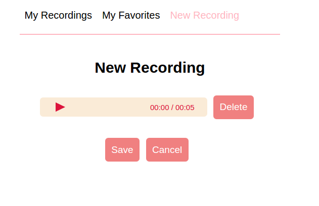
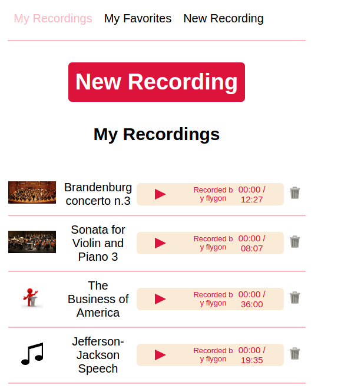
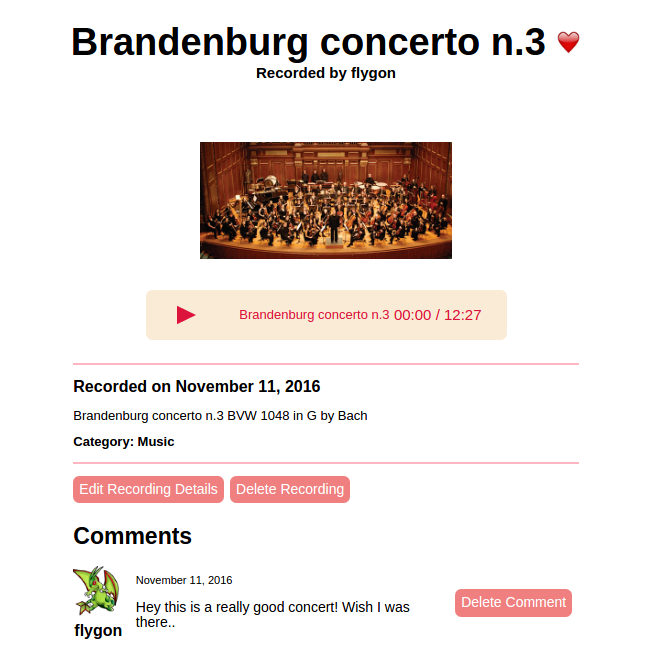

# RecordCloud

[RecordCloud live][direct]

[direct]: https://www.record-cloud.com/

## Features & Implementation

Note: In order to record the audio using the web API, a SSL is required. The current SSL is self-signed, therefore will trigger a privacy warning. Make sure to bypass this in order to access the site.

Record Cloud is a website for recording and sharing sounds. It is implemented with a Ruby on Rails backend using PostgreSQL for database, and React-Redux frontend.

### Recording Sounds

  In the database, each recording has columns for `id`, `uploader_id`, `title`, `recording_url`, `image_url`, `description`, `publicity`, and `category_id`. When a recording is submit, the data is uploaded to Cloudinary and saved to a url, and the rest of the columns get the information from the RecordingForm component.
  In order to record the sounds, the web API `MediaDevices.getUserMedia` is used, along with `Recorder.js` by Matt Diamond. This recorder creates a blob file, which then has to be turned into a data URL object in order to be uploaded onto Cloudinary.

  

### Recording Playback

  Each recording is played back using the `responsive-react-audio-player` for customization. There are players for each recording in `MyRecording`, `Favorites`, `Search`, and there is a single player for each recording in Recording.

  

### Favorites

  Each favorite has a `user_id` and `recording_id`. They are stored in the Favorites table. They are toggled by a heart icon on each `Recording` page.

  

### Categories

  Each category has a `name`. Each recording will belong to a category using the corresponding `category_id`. They can be changed during the creation of each Recording in `RecordingForm` or during edit on the same form. They are shown in each `Recording` page.

### Search

  Search was implemented using mostly the Rails backend. Each search result will search recordings using their `title`, `uploader_id`, and `category_id`. Methods were written to convert the name of each uploader and category to the `id` so that the search will perform faster.
